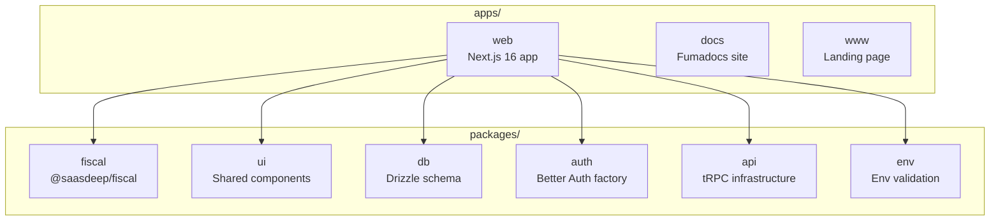

## Visão Geral do Monorepo

O Saasdeep Softwares é organizado como um monorepo **Turborepo** com apps e pacotes compartilhados.



## Layout de Diretórios

```
Saasdeep Softwares/
├── apps/
│   ├── web/                        # Aplicação web Next.js 16
│   │   ├── src/
│   │   │   ├── app/                # Páginas (admin, login, signup, rotas de API)
│   │   │   ├── components/         # Componentes UI (shadcn + customizados)
│   │   │   ├── lib/
│   │   │   │   ├── db/             # Schema Drizzle + singleton PGLite
│   │   │   │   ├── invoice-service.ts      # Orquestrador do ciclo de vida da nota
│   │   │   │   ├── invoice-repository.ts   # Persistência de notas (Drizzle)
│   │   │   │   ├── fiscal-settings-repository.ts
│   │   │   │   └── trpc/           # Routers tRPC (negócio + fiscal)
│   │   │   ├── messages/           # i18n (en.ts, pt-BR.ts)
│   │   │   └── proxy.ts            # Middleware do Next.js 16
│   │   ├── scripts/                # DB ensure, gerador ER, prepare-prod
│   │   └── data/                   # Banco de dados PGLite (gitignored)
│   ├── docs/                       # Este site de documentação (Fumadocs)
│   └── www/                        # Landing page
├── packages/
│   └── fiscal/                     # @saasdeep/fiscal — independente
│       └── src/
│           ├── __tests__/          # 754 testes (portados do PHP sped-nfe)
│           ├── value-objects/       # AccessKey, TaxId
│           ├── tax-icms.ts         # Motor de cálculo ICMS (25 variantes)
│           ├── tax-pis-cofins-ipi.ts
│           ├── xml-builder.ts      # Geração de XML NF-e
│           ├── certificate.ts      # Extração PFX + assinatura XML
│           ├── sefaz-*.ts          # Camada de comunicação SEFAZ
│           └── ...                 # 30+ módulos
├── turbo.json                      # Configuração de tarefas Turborepo
├── biome.json                      # Configuração do linter/formatter
├── Dockerfile                      # Imagem Docker dev (PGLite)
├── Dockerfile.production           # Imagem Docker produção (PostgreSQL)
└── compose.yaml                    # Docker Compose
```

## Descrição dos Pacotes

| Pacote | Nome | Descrição |
|--------|------|-----------|
| `apps/web` | — | Aplicação principal Next.js 16 com PDV, dashboard e interface fiscal |
| `apps/docs` | — | Site de documentação construído com Fumadocs |
| `apps/www` | — | Landing page |
| `packages/fiscal` | `@saasdeep/fiscal` | Biblioteca fiscal brasileira independente (NF-e/NFC-e), sem dependência de banco de dados |
| `packages/ui` | `@saasdeep/ui` | Componentes UI compartilhados (baseados em shadcn/Radix) |
| `packages/db` | `@saasdeep/db` | Schema Drizzle ORM e configuração do banco de dados |
| `packages/auth` | `@saasdeep/auth` | Factory e configuração do Better Auth |
| `packages/api` | `@saasdeep/api` | Infraestrutura de routers tRPC |
| `packages/env` | `@saasdeep/env` | Validação de variáveis de ambiente (t3-oss/env) |

## Tarefas do Turborepo

O `turbo.json` configura dependências de tarefas e cache:

- `dev` — executa todos os apps em paralelo
- `build` — faz build de todos os apps (respeita dependências)
- `check` — executa Biome lint + format em todo o monorepo
- `test` — executa testes por pacote
